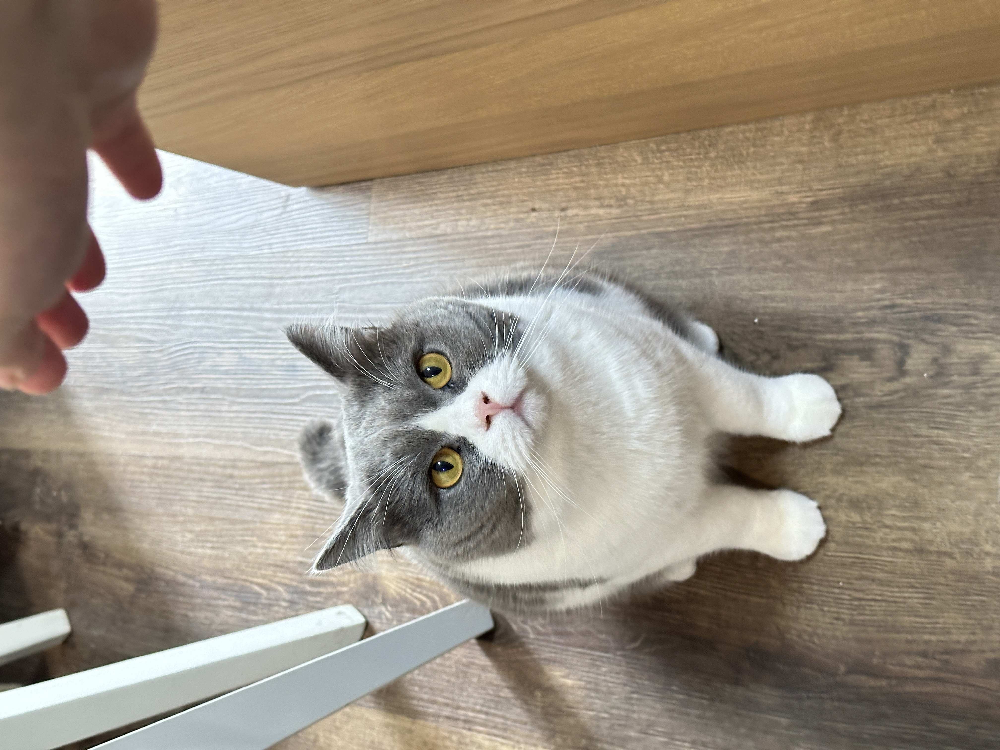

### 关于我 🧑🏻‍💻

* 水瓶座 ♒、INTJ 🌈、轻微强迫症 + 洁癖 🫧
* PUBG 多年快递员 📦，喜欢玩生存冒险类的游戏 🎮
* 好奇心强，喜欢学习新东西、写代码，喜欢人少风景好的地方 🌳
* 最喜欢的电视剧是《怪奇物语》！！！😆
* 领养了一只超级调皮的小猫咪 🍍，它胆子很小、粘人，爱撒娇，最大的爱好是睡觉 😪

### 关于网站 📗

* 博客框架：[Hugo](https://gohugo.io/)
* 博客主题：[Hugo Stack](https://stack.jimmycai.com/)
* 评论系统：[Waline](https://waline.js.org/)
* 部署构建：[Cloudflare Pages](https://dash.cloudflare.com/)
* 欢迎留言给我互相添加友情链接 🤩
